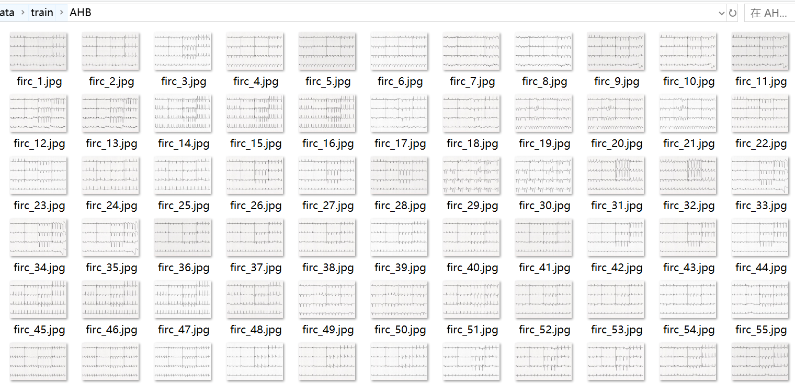
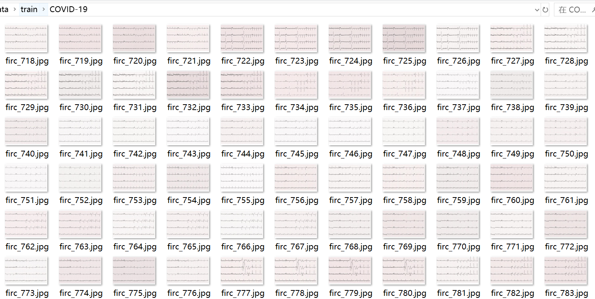
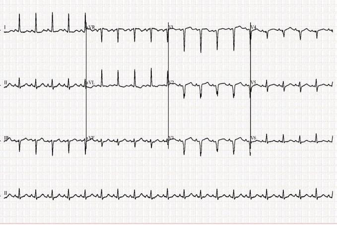
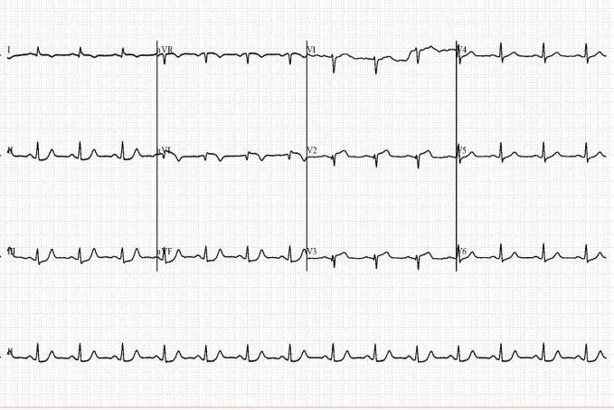

# ECG Electrocardiogram (ECG) Heart Attack Identification Image Classification Dataset: 3,935 Types

Data Set Type: Image classification for use, not for object detection without labeled files.
Data Set Format: Only contains JPG images, each category folder contains the corresponding image.
Number of Images (JPG File Count): 3,935
Number of Categories: 5
Category Names: ["AHB (Atrioventricular Heart Block)", "COVID-19 (Corona Virus Disease 2019)", "HMI (Healed Myocardial Infarction)", "MI (Myocardial Infarction)", "Normal (Normal Electrocardiogram)"]
- AHB: Atrioventricular Heart Block
- COVID-19: Corona Virus Disease 2019
- HMI: Healed Myocardial Infarction
- MI: Myocardial Infarction
- Normal: Normal Electrocardiogram

Each category has a number of images:

- Training set image count: 3,435
- - AHB training set image count: 717
- - COVID-19 training set image count: 726
- - HMI training set image count: 732
- - MI training set image count: 515
- - Normal training set image count: 745
- Validation set image count: 500
- - AHB validation set image count: 100
- - COVID-19 validation set image count: 100
- - HMI validation set image count: 100
- - MI validation set image count: 100
- - Normal validation set image count: 100
Test set image count: 0
Total images:
- AHB total image count: 817
- COVID-19 total image count: 826
- HMI total image count: 832
- MI total image count: 615
- Normal total image count: 845

Important Note: No guarantees are made regarding the accuracy of the trained models or weight files.

Special Declaration: The dataset does not make any guarantees regarding the accuracy of the trained models or weight files.

Image Preview:

## Images

Here is a pay link on Stripe ( https://buy.stripe.com/3cs8yP7sY87d0vu9AB ). Please contact me lonlonago@foxmail.com after funding $89, and I will send you a complete data files , thank you!

